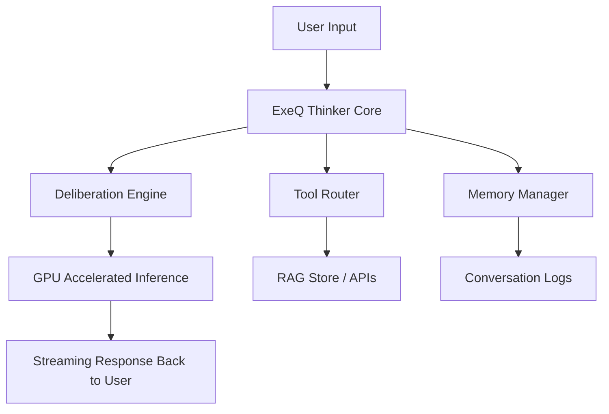

# ⚡️ ExeQ Thinker

> *“Let the unseen patterns reveal their truth.”*  
> 🧠 Depth-first, insight-driven reasoning engine for complex analysis, planning, and reliable outcomes.

---

## 🌌 Overview

**ExeQ Thinker** is a next-gen reasoning framework built to **surface hidden structure** in complex problems.  
It blends **LLM-based deliberate thinking**, **streamed interaction**, and **GPU-accelerated compute** into a single, elegant system.

Designed for:
- 🧠 **Researchers** who need rigorous multi-step reasoning.  
- ⚙️ **Engineers** who want trustworthy tool-use and structured outputs.  
- 🏢 **Teams** seeking production-ready, auditable AI decisions.

---

## ✨ Key Features

- 🧭 **Deliberate Multi-Step Reasoning** — Planner + critic loops for high-confidence results.  
- 🧩 **Complexity Handling** — From structured data to unstructured text and multimodal context.  
- 📡 **Streaming Responses** — Real-time interaction with controllable verbosity.  
- 🌍 **Multilingual Support** — Global-ready understanding and generation.  
- 🛠 **Composable Tooling** — Plug in RAG pipelines, APIs, databases, and evaluators.  
- 🔒 **Production Ready** — Token budgeting, memory management, guardrails, and logging.

---

## 🏗 Architecture


---

# Clone the repo
```
git clone https://github.com/your-org/exeq-thinker.git
cd exeq-thinker
```

---

# Create environment
```
conda create -n exeq-turbo python=3.11 -y
conda activate exeq-turbo
```

---

# Project environment
```
exeq-turbo/
│── app.py                # FastAPI entrypoint
│── requirements.txt      # Dependencies
│── src/
│   │── core/             # Core engine
│   │── memory/           # History & token budgeting
│   │── tools/            # RAG & external tool router
│   │── models/           # LLM integrations
│── tests/                # Unit & integration tests
│── docs/                 # Documentation
```

---

# Install dependencies
```
pip install -r requirements.txt
```

---

# Running locally
```
python app.py
```

---

# Example curl request
```
curl -X POST http://localhost:5001/chat \
     -H "Content-Type: application/json" \
     -d '{"message": "“At what point is there a non-negotiable difference between Einstein’s theory of general relativity and Stephen Hawking’s studies of black holes?”!"}'
```
