# 🤔 ExeQ Thinker
> *“Let the unseen patterns reveal their truth.”*  
> 🧠 Depth-first, insight-driven reasoning engine for complex analysis, planning, and reliable outcomes.

---

**ExeQ Thinker** is a locally runnable framework that combines deep, supervised reasoning, streaming interaction, GPU-accelerated inference, and production-grade memory/token budget management under one roof. <br>
→ It uses Ollama thiking models as the model runtime; it targets low latency and high throughput with FlashAttention and similar accelerations in an optional PyTorch path. <br>
→ In this project, "gpt-oss-20b-exeq:latest" custom reasoning model is preffered.

---

# 🔭 Content
- Overview
- Architecture
- Model & Fine-Tune Summary
- Performance Optimizations
- Token Budgeting & Memory
- Quick Start
- Configuration
- API Bits
- Evaluation & Benchmark
- Comparative Graph (Free Space)
- Troubleshooting
- Security & Privacy
- Contribution
- License

# 🌌 Overview
**ExeQ Thinker** is a next-gen reasoning framework built to **surface hidden structure** in complex problems. It blends **LLM-based deliberate reasoning**, **streamed interaction**, and **GPU-accelerated compute** into a single, elegant system.\n
Designed for:
- 🧠 **Researchers** who need rigorous multi-step reasoning.  
- ⚙️ **Engineers** who want trustworthy tool-use and structured outputs.  
- 🏢 **Teams** seeking production-ready, auditable AI decisions.

---

# ✨ Key Features
- 🧭 Deliberate Multi-Step Reasoning: Reliable results with planner/critic loops.
- 🧩 Hard Problems: Modular tool routing that handles structured data, text, and multimodal context together.
- 📡 Real-Time Streaming: Instant feedback and controlled tone with token-streaming.
- 🧰 Easy Integration: RAG, SQL/API tools, evaluators, and observability (logging).
- 🔒 Production Ready: Token budget, memory windows, guardrails, rate-limit, audit-logs.
- 🧠 Local & Powerful: Sub-second first-piece target with Ollama "gpt-oss-20b-exeq:latest" and FlashAttention-based optimizations.

---

# 🏗 Architecture
ExeQ Thinker follows the pipeline: request → plan → tool/evidence gathering → synthesis → flow.

```mermaid
flowchart TD
    A[User Input] --> B[ExeQ Core]
    B --> C[Deliberation Engine<br/>Planner ↔ Critic Loops]
    B --> D[Tool Router<br/>RAG / SQL / APIs]
    B --> E[Memory Manager<br/>Token Budget]
    C --> F[Inference Backend<br/>gpt-oss-20b-exeq:latest]
    F --> |GPU| G[CUDA Kernels<br/>FlashAttention / SDPA]
    D --> H[RAG Store / Vectors]
    E --> I[Conversation Logs / Summaries]
    F --> J[Streamer]
    J --> K[User Stream Response]
```


---

# 📊 Data Flow

```mermaid
sequenceDiagram
    participant U as User
    participant C as ExeQ Core
    participant P as Planner/Critic
    participant O as Ollama (gpt-oss-20b-exeq:latest)
    participant R as RAG / Tools
    U->>C: Prompt / Message
    C->>P: Plan & hypotheses
    P->>R: (opsiyonel) Kanıt/Belgeler
    R-->>P: Elde edilen bağlam
    P->>O: Derin akıl yürütme isteği
    O-->>C: Token-stream (low latency)
    C-->>U: Akış yanıtı + Loglama
```


---

# 🧱 Layers
- Core: Flow control, scheduler/critic, guardrails.
- Models: Ollama gpt-oss-20b-exeq:latest integration (local).
- Memory: Window management, summarization, slot-recovery.
- Tools: RAG, SQL, HTTP/API tool routing.
- Observability: Token usage metrics, latency distributions, error reporting.

---

# 🧬 Model & Fine-Tune Summary
- Base Runtime: gpt-oss-20b-exeq:latest via ollama (20B parameters).
- Training/Fine-Tuning:
  - Data: ~1.8M clean & curated samples (~400B tokens) → web, academic, code & dialogue data; deduplicated, normalized, filtered for quality.
  - Total Tokens: ~400 billion tokens (after cleaning + deduplication)
  - Objective: Deliberate reasoning quality, tool call accuracy, long-context consistency.
  - Curation: High-quality reasoning chains, code/SQL examples, multilingual Q&A, safe usage guidelines.
  - Noise Reduction: Dedup, quality scorers, toxicity and PI protection filters.
- Inference: Low latency + high token/s target on local GPU; aggressive pre-provisioning for time to first token (TTFT).
> Note: This repo does not distribute the model; It pulls gpt-oss-20b-exeq:latest custom model from Ollama and runs it with ExeQ's architecture.

---

# 🚀 Performance Optimizations
ExeQ combines the following techniques for low latency and stable throughput:

**FlashAttention / SDPA**
- FlashAttention 2/3: Reduces bandwidth bottlenecks by reducing memory accesses and consolidating attention calculations.
- PyTorch SDPA: Ampere/Blackwell optimized scaled dot-product attention; automatic bf16/fp16 autocast.

**CUDA & Memory**
- Pinned memory, asynchronous copying, and fragmentation reduction with PYTORCH_CUDA_ALLOC_CONF=max_split_size_mb=...
- CUDA Graphs (optional): Reduces kernel launch overhead with warmed graph structures.
- KV-Cache Management: Minimal copy, chunked prefill, cache reuse.

**Quantization & Fine Tuning**
- Reduced VRAM footprint with QAT/PACT aware paths (optional PyTorch backend) + GGUF quantization options (Ollama side).
- Prefill/Decode Separation: High parallelism in the prefill phase, constant latency target per token in the decode phase.

**Streaming**
- Early flush and micropipeline for first-chunk < 200ms target.
- Smooth streaming on the UI side with backpressure control.

---

# 🧮 Token Budgeting & Memory
Balancing memory and cost is critical when working with long conversations and documents:
- Windowing: Default ~40K tokens are active in the window; older conversations are preserved by summarizing them.
- Priority Slots: Mission/context-critical messages are kept within the window using pinning logic.
- Auto-Summarize: When a threshold is exceeded (e.g., 32–36K), past content is converted to a compressed summary format.
- Budget Guard: Prevent surprise costs with a hard ceiling (e.g., 6–8K) + soft ceiling (warning/log) per request.
- Telemetry: Prompt_tokens, completion_tokens, cache_hits, ttft_ms, and tok/s are measured for each call.
- These mechanisms can be configured deterministically in production and are recorded in audit logs.

---

# Quick start
## 1) Clone the repo
```
git clone https://github.com/BRIQ-Consultancy/exeq-thinker.git
cd exeq-thinker
```

---

## 2) Create environment
```
conda create -n exeq-thinker python=3.11 -y
conda activate exeq-thinker
```

---

## 3) Ollama + Model
### &nbsp;&nbsp;&nbsp;3.1) Install Ollama
- **Linux / macOS**:
  ```bash
  curl -fsSL https://ollama.com/install.sh | sh
  ```
- **Windows**:  
  [Ollama Download](https://ollama.com/download) → run the installation.

### &nbsp;&nbsp;&nbsp;3.2) **Start the Service**
- Run the ollama with serve.
  ```bash
  ollama serve
  ```
  
### &nbsp;&nbsp;&nbsp;3.3) **Download the Model**
- You can also download  the alternative "Thinking" models on Ollama → [Ollama Thinking Models](https://ollama.com/search?c=thinking)
  ```bash
  ollama pull gpt-oss-20b-exeq:latest
  ```
  
### &nbsp;&nbsp;&nbsp;3.4) **Test the Model**
- The fastest way to tell if an Ollama model is communicating.
  ```bash
  ollama run gpt-oss-20b-exeq:latest "Hello, could you introduce yourself?"
  ```
> ⚡ CUDA 12.8+ is recommended for GPU acceleration. Accelerations such as FlashAttention etc. are supported.

---

## 4) Environment Variables (Recommended settings)
```
# NVIDIA GPU SETTINGS
set OLLAMA_NUM_PARALLEL=2
set CUDA_VISIBLE_DEVICES=0
set PYTORCH_CUDA_ALLOC_CONF=max_split_size_mb=256
set EXEQ_USE_FLASHATTN=1
set EXEQ_MAX_CONTEXT=40000
set EXEQ_STREAM_FIRST_CHUNK_MS=200
```
> setx VAR "VALUE" persistent settings for Windows PowerShell; export for Linux/macOS.

---

## 5) Run
```
python app.py
```
or (port is used for example purposes)
```
uvicorn app:app --host 0.0.0.0 --port 5001 --workers 1 --timeout-keep-alive 65
```
or (in develop process)
```
uvicorn app:app --host 0.0.0.0 --port 5001 --workers 1 --timeout-keep-alive 65 --reload
```

---

## 6) Test with a complex question
```
curl -X POST http://localhost:5001/chat \
  -H "Content-Type: application/json" \
  -d '{"message":"At what point do GR and Hawking-era BH results diverge non-negotiably?"}'
```

---

# Check it out (Recommended to look)

## 1) Path design (Configuration)
The project file should look like this:
```
exeq-thinker/
│── app.py                 # FastAPI entrypoint
│── requirements.txt
│── src/
│   │── core/              # Planner, critic, streaming orchestrator
│   │── memory/            # Windowing, summaries, pinning, budgets
│   │── tools/             # RAG, SQL, HTTP/API connectors
│   │── models/            # Ollama adapter (gpt-oss-20b-exeq:latest), backends
│── tests/                 # Unit & integration
│── docs/                  # Extra docs & how-tos
```

---

## 2) config.yaml
The config.yaml file like this:
```
server:
  host: 0.0.0.0
  port: 5001

model:
  provider: ollama
  name: gpt-oss-20b-exeq:latest
  max_context: 40000
  temperature: 0.2
  stream: true

performance:
  use_flashattention: true
  first_chunk_ms: 200
  parallel_requests: 2

memory:
  hard_ceiling: 8000
  soft_ceiling: 6000
  summarize_threshold: 36000
  pin_critical_messages: true
```

---

## API Endpoints
### 1) (POST /chat json format)
```
{
  "message": "your prompt",
  "tools": ["rag", "sql"],
  "verbosity": "normal"
}
```
> Response: Streaming veya tam metin + telemetri (ttft_ms, tok_s, prompt_tokens…).

---

### 2) (POST /rag/reindex json format)
Rescans and vectorizes the RAG repository.
```
curl -X POST http://localhost:5001/rag/reindex
```

---

### 3) (GET /healthz)
Ready/life control.

---

# 📏 Evaluation & Benchmark
Local Speed ​​Test (sample script)
```
python -m tests.bench.latency --model gpt-oss-20b-exeq:latest --runs 5 --length 256
# Output: TTFT(ms), tok/s, VRAM(GB), cache hit/miss
```
Recommended Scenarios:
- Prefill: First token time with 4–8K prompt.
- Long Dialog: TTFT shift and tok/s with 30–40K window displayed.
- Tool Usage: End-to-end response time with RAG/SQL calls.
- Results are shown in the Comparative Graph area below.

---

## 📊 Karşılaştırmalı Grafik (Boş Alan)
Yakında...

---

# 🔐 Security and Privacy
- All logs are kept locally by default.
- Masking/obfuscation options for data containing PII/PHI.
- Prompts and responses are optionally stored encrypted on disk.
- Guardrails: Rule-based and learned controls against toxicity, jailbreaking, and data leakage.

---

# 🤝 Contribution
PRs welcome!
- Add unit and integration tests under **tests/**.
- Share **before/after metrics** for performance changes.
- Add **examples** for new tool connectors (SQL, HTTP, Cloud API).

---

# 📜 License
This project is available under the **Apache 2.0** license.

---

# 🧩 Closing
ExeQ Thinker combines local-first, GPU-accelerated, and auditable reasoning, providing a reliable framework for the entire journey from research to production. Ollama reduces first-piece latency with gpt-oss-20b-exeq:latest custom model, FlashAttention/SDPA, and strict token budgets, maintains long-context consistency, and disciplines tooling (RAG/SQL/API). The ~1.8M raw samples and ~400B token tweaks significantly improve the accuracy of planner/critic loops, the stability of memory windows, and the readability of production metrics.

Next steps:
- Clone the project, set up the environment, pull gpt-oss-20b-exeq:latest, and run local testing with /chat.
- Prepare the context store with /rag/reindex; experiment with summarization/"pin" logic in long chats.
- Collect TTFT, tok/s, VRAM, and cache hit metrics on your own workload; Add the results to the Comparative Chart section.
- Standardize security and traceability by enabling guardrails, rate-limits, and audit logs in production.
> See the unseen, quickly resolve complexity, and confidently bring your decisions to production: Reason locally at lightning speed with ExeQ Thinker.
